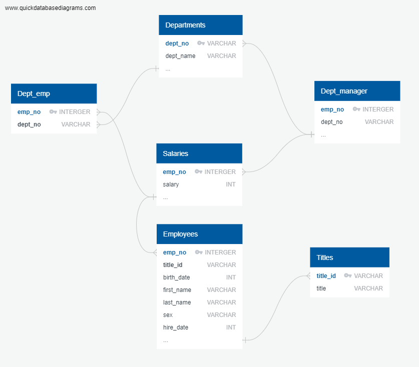

Employee Database: Grupo Cassatt Sociedad Anonima


## Background

I´ve been hired as a new data analyst at Grupo Cassatt. My first major task is a research project on employees of the corporation from the 2000s. All that remain of the database of employees from that period are six CSV files.

## Scope

1. Data Engineering

Design the tables to hold data in the CSVs, import the CSVs into a SQL database, and answer questions about the data. In other words, you will perform:
**Note**: term "Data Modeling" in place of "Data Engineering," same terms. Data Engineering is the more modern wording instead of Data Modeling.

2. Schema EDR



  * Use the information to create a table schema for each of the six CSV files. Remember to specify data types, primary keys, foreign keys, and other constraints.
  * For the primary keys check to see if the column is unique, otherwise create a [composite key](https://en.wikipedia.org/wiki/Compound_key). Which takes to primary keys in order to uniquely identify a row.
  * Be sure to create tables in the correct order to handle foreign keys.
  * Import each CSV file into the corresponding SQL table. 
 **Note** be sure to import the data in the same order that the tables were created and account for the headers when importing to avoid errors.

#### Data Analysis

Once completed and imported a single database. following steps:

1. List the following details of each employee: employee number, last name, first name, sex, and salary.

2. List first name, last name, and hire date for employees who were hired in 1986.

3. List the manager of each department with the following information: department number, department name, the manager's employee number, last name, first name.

4. List the department of each employee with the following information: employee number, last name, first name, and department name.

5. List first name, last name, and sex for employees whose first name is "Hercules" and last names begin with "B."

6. List all employees in the Sales department, including their employee number, last name, first name, and department name.

7. List all employees in the Sales and Development departments, including their employee number, last name, first name, and department name.

8. In descending order, list the frequency count of employee last names, i.e., how many employees share each last name.

## Bonus (Optional for our boss)

As you examine the data, you are overcome with a creeping suspicion that the dataset is fake. You surmise that your boss handed you spurious data in order to test the data engineering skills of a new employee. To confirm your hunch, you decide to take the following steps to generate a visualization of the data, with which you will confront your boss:

1. Import the SQL database into Pandas. (Yes, you could read the CSVs directly in Pandas, but you are, after all, trying to prove your technical mettle.) This step may require some research. Feel free to use the code below to get started. Be sure to make any necessary modifications for your username, password, host, port, and database name:

   ```sql
   from sqlalchemy import create_engine
   engine = create_engine('postgresql://localhost:5432/<your_db_name>')
   connection = engine.connect()
   ```

* Consult [SQLAlchemy documentation](https://docs.sqlalchemy.org/en/latest/core/engines.html#postgresql) for more information.

* If using a password, do not upload your password to your GitHub repository. See [https://www.youtube.com/watch?v=2uaTPmNvH0I](https://www.youtube.com/watch?v=2uaTPmNvH0I) and [https://help.github.com/en/github/using-git/ignoring-files](https://help.github.com/en/github/using-git/ignoring-files) for more information.

2. Create a histogram to visualize the most common salary ranges for employees.

3. Create a bar chart of average salary by title.

## Epilogue

Evidence in hand, you march into your boss's office and present the visualization. With a sly grin, your boss thanks you for your work. On your way out of the office, you hear the words, "Search your ID number." You look down at your badge to see that your employee ID number is 499942.

## Submission

* Create an image file of your ERD.

* Create a `.sql` file of your table schemata.

* Create a `.sql` file of your queries.

* (Optional) Create a Jupyter Notebook of the bonus analysis.

* Create and upload a repository with the above files to GitHub and post a link on BootCamp Spot.

## Conclusions

When making the database from the information that our boss handed we had the following outliers analyzing the following queries on SQL:

When doing the mean for each salary by title, I discovered that the Staff is earning $58465 on average (almost the same as a Senior Staff), this table below prooves this:
<p class="text-cente">Assistant Engineer 48564.0 Engineer 48535.0 Manager 51531.0 Senior Engineer 48507.0 Senior Staff 58550.0 Staff 58465.0 Technique Leader 48583.0</p>

Moreover when I created a histogram bar chart, the company is expending more than double than any other healthy company, on salaries ranging $40000 - $60000 which could be interpreted as an outlier - Either the company is saving money on higher salary titles, or they are paying way too many on lower salary titles.

If data is correct and boss is not playing games to test our knowledge then changes on real life salaries most be done. According to Hadzima, once you have taken into consideration basic salary, taxes and benefits, the real costs of your higher positions employees are typically in the 1.75 to 2 times more compared with base salaries. In other words, if and employee with a title of Staff is earning $40000 then the Senior Staff most earn $80000.

_______________________________________________
- Email: <roberto.gonzalez.vallejo@gmail.com>
- Author: [Roberto Gonzalez Vallejo](mailto:roberto.gonzalez.vallejo@gmail.com)
- [**Linkedin**](https://www.linkedin.com/in/roberto-gonzalez-vallejo-6ba894144/)
- [**Github**](https://github.com/roberto-g-v)
- © 2020
